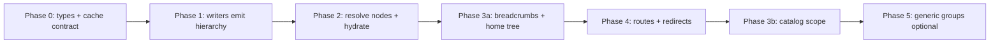

# Plan: Manifest-driven hierarchy (UI-agnostic grouping)

## Goal

Stop encoding the Dinalab **site → deployment → night → patches** shape in routes, breadcrumbs, and the home tree. Instead:

- **`dataset.json` declares in-package grouping levels** (dataset itself is implicit — not a level).
- **Adapters** map source folder layouts into those levels + patch foreign keys.
- **UI** renders tree/breadcrumbs from manifest + resolved grouping nodes, not from `deriveSiteFromDeploymentFolder` or fixed route segment names.
- **Classification UI** keeps working with a single **leaf group id** (today `nightId` / `camera_day_id`).

---

## Locked decisions (before implementation)

These were open in the first draft; lock them now to unblock Phase 0/1.

| # | Decision | Choice | Rationale |
|---|----------|--------|-----------|
| 1 | Patch-images-only leaf model (v1) | **1A — synthetic `camera_day_id`** | One id per dataset, e.g. `{dataset_id}__default`. Reuse `camera-days.ndjson` + `leaf.patch_field: "camera_day_id"`. Minimal churn; no `groups.ndjson` in v1. |
| 2 | Site in manifest | **2B — site is never a manifest level** | Site stays display-only, derived from deployment records when needed (current behavior). Do **not** put `site` in `hierarchy.levels`. Do **not** use `parent_field: "site_id"` on deployment in the manifest schema. |
| 3 | Route cutover | **3A — new route + redirect shim** | Add canonical route; keep old URLs as redirects for one release. |
| 4 | URL / cache dataset key | **Folder name in URLs (v1)** | Match `datasetsRegistry` and `PackageSessionCacheEntry.folderName` today. Manifest `dataset_id` remains record identity; if it diverges from folder name, URLs and cache use **folder name**. Revisit in Phase 5 if needed. |
| 5 | Session cache on hierarchy rollout | **Invalidate, do not silently reuse** | Bump `PACKAGE_SESSION_CACHE_VERSION`; entries without hierarchy support or pre-upgrade version are dropped. On restore, always `resolveHierarchyFromManifest(manifest)` before UI hydration. |

---

## Principles

| Rule | Rationale |
|------|-----------|
| No `dataset` level in `hierarchy.levels` | One open package = one dataset context (sidebar title, `dataset_id`, species scope). |
| No `site` level in `hierarchy.levels` | Site is derived for Dinalab display only; optional skip rules stay in display helpers. |
| Leaf level is the **classification bucket** | Grid, selection, ingest, summaries attach to leaf id only. |
| Optional levels are skippable in UI | Flat image-only → one manifest level; no fake Site/Deployment chrome. |
| **Single read path for nav** | Breadcrumbs and home tree read `resolveHierarchyNodes` + manifest only — not legacy entity stores. |
| Legacy stores are write-through aliases (transition) | `nightsStore` etc. remain for classification code (`nightId` on patches/detections) until internal rename. |
| Backward compatible | v2 packages without `hierarchy` infer Dinalab deployment + night from existing NDJSON. |
| Rename internally, alias externally | New code uses `leafGroupId`; keep `nightId` on entities until Phase 5. |

---

## Phase 0 — Spec & types (1 PR)

### 0.1 Manifest schema (`dataset.json` v3)

Add optional `hierarchy` block. Bump manifest `version` to `3` when present; v2 packages keep working.

**Dinalab (two in-package levels; site derived, not declared):**

```json
{
  "format": "mothbox-next-dataset",
  "version": 3,
  "dataset_id": "dinacon-2024",
  "hierarchy": {
    "levels": [
      {
        "key": "deployment",
        "label": "Deployment",
        "records": "02_records/deployments.ndjson",
        "id_field": "deployment_id",
        "parent_field": null
      },
      {
        "key": "night",
        "label": "Night",
        "records": "02_records/camera-days.ndjson",
        "id_field": "camera_day_id",
        "parent_field": "deployment_id"
      }
    ],
    "leaf": {
      "key": "night",
      "patch_field": "camera_day_id"
    }
  }
}
```

**Patch-images-only (v1 — reuses existing NDJSON, decision 1A):**

```json
{
  "hierarchy": {
    "levels": [
      {
        "key": "night",
        "label": "Images",
        "records": "02_records/camera-days.ndjson",
        "id_field": "camera_day_id",
        "parent_field": null
      }
    ],
    "leaf": {
      "key": "night",
      "patch_field": "camera_day_id"
    }
  }
}
```

Writer emits one synthetic `camera-days` row: `camera_day_id: "{dataset_id}__default"`, all patches point at it. UI shows one leaf level — no Site/Deployment crumbs.

> **Deferred to Phase 5:** generic `02_records/groups.ndjson` + `group_id` on patches. Do not add to v1 fixtures or parser tests.

### 0.2 TypeScript types

**Files:**

- `src/features/mothbox-next/dataset-manifest.ts` — extend `MothboxNextDatasetManifest`, `parseDatasetManifest`
- `src/features/mothbox-next/hierarchy-manifest.ts` (new) — `HierarchyLevelDef`, `resolveHierarchyFromManifest(manifest)`, `defaultDinalabHierarchy()`

### 0.3 Active hierarchy + cache contract

**Files:**

- `src/features/mothbox-next/active-hierarchy.ts` (new) — derived from `mothboxNextPackageStore` + manifest
- Set on package open in `reload-package.ts` / `open-mothbox-next-package.ts`
- `src/features/data-flow/3.persist/package-session-cache.ts` — bump `PACKAGE_SESSION_CACHE_VERSION`; invalidate entries that predate hierarchy support

**Restore rule:** always run `resolveHierarchyFromManifest(manifest)` after cache restore; never assume legacy four-store shape is authoritative for nav.

### 0.4 Tests

- Parse v2 manifest → inferred Dinalab hierarchy (deployment + night)
- Parse v3 manifest → explicit levels
- Patch-images-only default hierarchy (single synthetic leaf, 1A shape)
- Cache: pre-upgrade entry → invalidated or re-hydrated with inferred hierarchy

---

## Phase 1 — Writers emit hierarchy (1 PR)

**Prerequisite:** locked decisions 1A and 2B (above).

Every package setup path writes `hierarchy` into `dataset.json`.

| Adapter / writer | Hierarchy emitted |
|------------------|-------------------|
| Dinalab (`write-dinalab-adapter-package.ts`) | `deployment` + `night` (labels: Deployment, Night) |
| Patch-images-only (`build-patch-images-only-records.ts`) | **One level:** `night` / label "Images", synthetic `camera_day_id` = `{dataset_id}__default` |
| Merged / foreign folder | Preserve existing manifest hierarchy or re-derive |

**Also:**

- `adapter-report.json`: `hierarchy_key` / `source_layout` for debugging
- Update fixture `04_dinacon_lightweight_substrate/dataset.json` to v3 sample (Dinalab two-level only)

---

## Phase 2 — Generic grouping resolution (1–2 PRs)

### 2.1 Resolve grouping nodes from manifest + records

**New module:** `src/features/mothbox-next/resolve-hierarchy-nodes.ts`

Input: manifest hierarchy + loaded NDJSON  
Output:

```ts
type HierarchyNode = {
  levelKey: string
  id: string
  label: string
  parentId?: string
  children?: HierarchyNode[]
}
```

**Logic:**

- Read each level's `records` file → rows → nodes (`id_field`, display name from `hierarchy-display-labels.ts` or row fields).
- Build parent links via `parent_field` (null at top of in-package tree).
- Attach patches to leaf via `leaf.patch_field`.
- **Site:** when rendering Dinalab deployments, derive site label via existing helpers only — site is not a node in this tree.

### 2.2 Hydration bridge — dual write, single read

**File:** `src/features/mothbox-next/hydration-bridge.ts`

1. `resolveHierarchyNodes(manifest, records)` → canonical tree for **nav UI**.
2. **Adapter to legacy stores** (temporary): map known level keys → existing stores for classification code:
   - `deployment` → `deploymentsStore`
   - `night` → `nightsStore`
   - derived site → `sitesStore` (display/skip rules only)
3. Single synthetic `project` = `dataset_id` (workspace scope, not a manifest level).

**Ownership rule:**

| Consumer | Reads from |
|----------|------------|
| Breadcrumbs, home tree, link builder | `resolveHierarchyNodes` + manifest |
| Patch grid, selection, summaries, detections | legacy stores / `nightId` (alias of leaf id) |

Add a test: mutating legacy stores without updating resolved nodes must not change breadcrumb output (proves nav single-owner).

### 2.3 Infer hierarchy for v2 packages

If `manifest.hierarchy` missing:

```ts
defaultDinalabHierarchy() // deployment + night, same record paths as today
```

Flat infer: when only one synthetic `camera_day_id` exists (patch-images-only), treat as single-level hierarchy.

---

## Phase 3a — Nav UI (1 PR) — first user-visible win

Scope: **navigation only**. Do not refactor catalog/morpho scope in this PR.

### 3a.1 Breadcrumbs

**File:** `src/components/nav.tsx` — replace hardcoded `getBreadcrumbs`.

1. Match route → resolve **leaf group id**.
2. Walk **parent chain** from `HierarchyNode` map using manifest level order.
3. Each crumb: `{ label: node.label, entityName: level.label }`.
4. Skip empty/synthetic levels via `shouldSkipLevel(levelKey, nodes)` (generalize from `shouldSkipSiteLevelInProjectsTree`).

**Dataset name:** app context (header/sidebar), **not** a breadcrumb step.

### 3a.2 Home tree

**File:** `src/routes/0.home/projects-section.tsx`

Replace fixed `DatasetSitesTree` → … → `NightsList` with:

- `HierarchyTree` driven by `resolveHierarchyNodes` + manifest `levels`
- Recursive `HierarchyTreeLevel` (expand/collapse, progress per node)
- Links via `hierarchy-routes.ts` (opaque leaf id; folder name as dataset segment per decision 4)

Progress index: alias `byLeafGroup` internally; keep `byNight` key until Phase 5.

### 3a.3 Link builder (minimal)

**New:** `src/features/mothbox-next/hierarchy-routes.ts`

```ts
buildLeafGroupUrl({ folderName, leafGroupId })  // v1: folderName, not manifest dataset_id
buildLeafGroupRouteParams({ leafGroup, hierarchyNodes })
```

**Verification (Phase 3a exit):**

- Only-Images: one breadcrumb level ("Images"), no Site/Deployment
- Dinacon fixture: Deployment → Night labels from manifest
- Morpho/catalog dialogs unchanged (still work at dataset scope)

---

## Phase 3b — Catalog scope (follow-up PR)

**Deferred from original Phase 3.** Do after leaf URLs exist or entity parent chains are stable.

**Files:** `catalog-utils.ts`, `morpho-catalog-dialog.tsx`, `details-common.tsx`, `catalog-scope-context.ts`

Refactor scope filters to use entity parent chain + leaf ids, not `extractRouteIds` parsing `/projects/.../deployments/.../nights/...`.

- **Dataset scope** = all leaf groups in open package
- **Level scope** = leaf groups under a node id at any manifest level

---

## Phase 4 — Routes & redirects (1 PR)

### 4.1 Canonical route (decision 3A)

```text
/datasets/$folderName/groups/$leafGroupId
```

- `folderName` = registry / cache key (decision 4)
- `leafGroupId` = opaque leaf id (`camera_day_id`, etc.)

**Files:**

- `src/router.tsx` — add route; old route as redirect shim
- `src/routes/5.night/index.tsx` — conceptually `LeafGroupView`; param `leafGroupId`
- Gradually replace `buildNightRouteParams` / `buildNightUrl`

### 4.2 Redirect old URLs

`/projects/$projectId/deployments/$deploymentId/nights/$nightId` → resolve via stores → redirect to new URL. Remove shim after one release.

**Verification:** package where `dataset_id !== folderName` — open, navigate, cache restore, old bookmark redirect all resolve same leaf.

---

## Phase 5 — Generic group records (optional, later)

| Concern | Approach |
|---------|----------|
| Generic patch grouping field | Add `group_id`; manifest `leaf.patch_field` points to it |
| Level-specific NDJSON | `02_records/groups.ndjson` with `{ id, level_key, parent_id, label }` |
| Dinalab adapter | Writes legacy fields + generic groups during transition |
| URL key | Re-evaluate folder name vs `dataset_id` |

**Not required for v1 milestone** with decision 1A.

---

## Phase 6 — Legacy ingest boundary

**Out of scope for hierarchy UI** — document only:

- Filesystem ingest (`ingest-paths.ts`, `parsePathParts`) stays Dinalab-specific.
- Only **mothbox-next package open** uses manifest hierarchy.
- `legacyIngestEnabled` path unchanged until removed.

---

## Migration & compatibility

| Case | Behavior |
|------|----------|
| v2 `dataset.json`, no `hierarchy` | Infer Dinalab deployment + night |
| v3 with `hierarchy` | Use explicit levels |
| IDB package session cache | Bump version; invalidate stale entries; re-hydrate hierarchy on restore |
| Old bookmarks | Redirect route shim (Phase 4) |
| Only-Images flat folder | Single leaf level; synthetic `camera_day_id` |

**Re-open existing packages:** v2 without hierarchy → infer in memory; persist v3 on next save (optional one-time upgrade).

---

## Testing plan

| Area | Tests |
|------|--------|
| Manifest parse | v2 infer, v3 Dinalab, v3 flat 1A — **no `groups.ndjson` in v1** |
| Node resolution | Dinacon fixture, Hoya wrapped deployment, patch-images-only synthetic leaf |
| Nav single-owner | Legacy store mutation does not change breadcrumb output |
| Breadcrumbs | Level labels; skip derived site; Only-Images one level |
| Tree | Depth for 1-level vs 2-level hierarchy |
| Cache | Pre-upgrade entry invalidated; restore uses inferred hierarchy |
| Routes (Phase 4) | Old URL → redirect; `dataset_id !== folderName` |
| Regression | Classification grid, selection, summaries still keyed by leaf id |
| Catalog (Phase 3b) | Scope without URL segment parsing |

---

## PR order



**First user-visible win:** Phase 1 + 2 + 3a (correct Only-Images labels; no fake Site/Deployment).

**Second win:** Phase 4 (clean URLs) + Phase 3b (catalog scope decoupled from Dinalab paths).

---

## Files touched (summary)

| Area | Primary files |
|------|----------------|
| Manifest | `dataset-manifest.ts`, `hierarchy-manifest.ts`, `write-dinalab-adapter-package.ts`, fixtures |
| Resolution | `resolve-hierarchy-nodes.ts`, `hydration-bridge.ts`, `active-hierarchy.ts`, `reload-package.ts` |
| Cache | `package-session-cache.ts`, `restore-package-session-cache.ts`, tests |
| Nav UI (3a) | `nav.tsx`, `projects-section.tsx`, `hierarchy-display-labels.ts`, `hierarchy-routes.ts` |
| Catalog (3b) | `catalog-utils.ts`, `catalog-scope-context.ts`, morpho/species dialogs |
| Routes (4) | `router.tsx`, `5.night/*` |
| Adapters | `build-dinalab-adapter-records.ts`, `build-patch-images-only-records.ts` |
| Docs | `docs/mothbox-next-package.md` (entity bridge + hierarchy section) |

---

## Start here

**Phase 0 + Phase 1** with locked decisions **1A, 2B, 3A, folder-name URLs, cache invalidate**.
